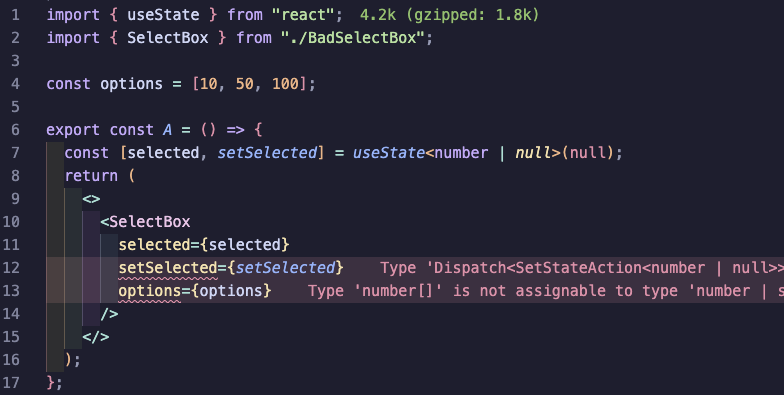
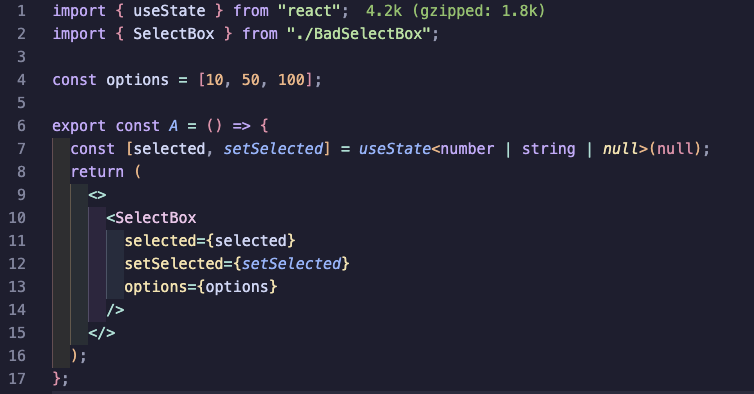
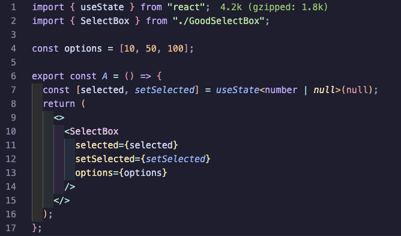
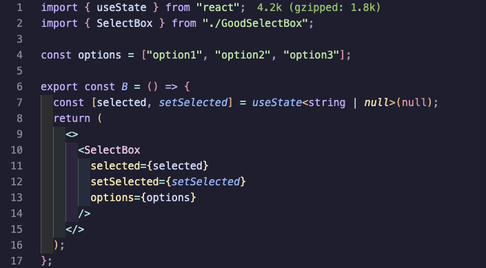
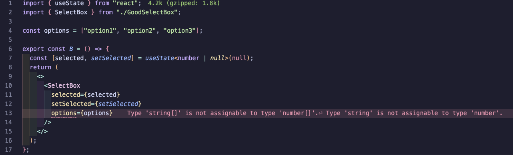

# 컴포넌트 개발할 때는 제네릭을 잘 활용하자

7월13일

여러분은 제네릭을 잘 활용하고 있나요?

최근에 회사에서 기존 컴포넌트를 제네릭으로 개선한 경험이 있어서 기록하는 겸 포스팅하려고 해요.

여기 SelectBox라는 컴포넌트가 있어요. (문맥상 필요 없는 코드는 생략했어요.)

이 컴포넌트의 문제점이 눈에 들어오시나요…?

```tsx
import { Dispatch, SetStateAction } from "react";

type SelectBoxType = {
  selected: number | string | null;
  setSelected: Dispatch<SetStateAction<number | string | null>>;
  options: number[] | string[];
};

export const SelectBox = ({
  selected,
  setSelected,
  options,
}: SelectBoxType) => {
  return <></>;
};
```

A라는 컴포넌트에서 이 SelectBox를 사용해볼게요.

응? 타입 에러가 발생하네요.



SelectBox 컴포넌트에서 selected와 setSelected의 타입이 각각 아래와 같이 정의되어 있어서 타입 에러가 발생하고 있어요.

```tsx
selected: number | string | null;
setSelected: Dispatch<SetStateAction<number | string | null>>;
```

타입을 아래와 같이 수정하면 에러는 발생하지 않아요.

하지만 잠깐만요!!



A 컴포넌트에서 사용되는 SelectBox는 options가 number 타입이니까, selected의 타입을 number | string | null로 지정하는 건 좀 이상하죠? options가 number 타입이면 selected가 string 타입이 되는 일은 없잖아요…

이렇게 되면 타입 에러는 발생하지 않지만, 코드 문맥이 이상해지고 나중에 코드 리딩이 힘들어질 거예요.

이 문제는 제네릭으로 쉽게 해결할 수 있어요!

SelectBox를 아래와 같이 수정해볼게요.

```tsx
import { Dispatch, SetStateAction } from "react";

type SelectBoxType<T> = {
  selected: T;
  setSelected: Dispatch<SetStateAction<T>>;
  options: number[] | string[];
};

export const SelectBox = <T extends number | string | null>({
  selected,
  setSelected,
  options,
}: SelectBoxType<T>) => {
  return <></>;
};
```

이제 selected는 제네릭 타입이 되었고, number | string | null 타입만 들어오도록 제약을 줬어요.

A 컴포넌트에서 확인해보면…?



이제 number | null 타입을 지정해도 타입 에러가 발생하지 않죠? 👍

options를 string 타입으로 사용해도 문제가 없는 것도 확인할 수 있어요.



한 가지 더 말해주자면, options 타입도 제네릭으로 바꿔주는 게 좋아요. options 타입이 number[] | string[]라는 건 맞지만, 엄밀히 말하자면 selected의 타입과 일치해야 하니까, 아래와 같이 options의 타입을 NonNullable<T>[]로 수정해줄게요.

```tsx
import { Dispatch, SetStateAction } from "react";

type SelectBoxType<T> = {
  selected: T;
  setSelected: Dispatch<SetStateAction<T>>;
  options: NonNullable<T>[];
};

export const SelectBox = <T extends number | string | null>({
  selected,
  setSelected,
  options,
}: SelectBoxType<T>) => {
  return <></>;
};
```

이렇게 수정하면 이제 개발자가 엉뚱한 짓을 하면 TypeScript가 오류를 발생시켜주니까, 코드를 더욱 안전하게 작성할 수 있어요.



타입 에러가 발생하지 않도록 타입을 정의하는 것보다, 문맥을 고려해서 타입을 정의하는 것이 중요해요. 당연한 이야기지만, 가끔씩 타입을 무작정 정의하는 경우도 종종 있는 것 같아요.

제네릭을 잘 활용하면서 개발해보자고요~! 😉
